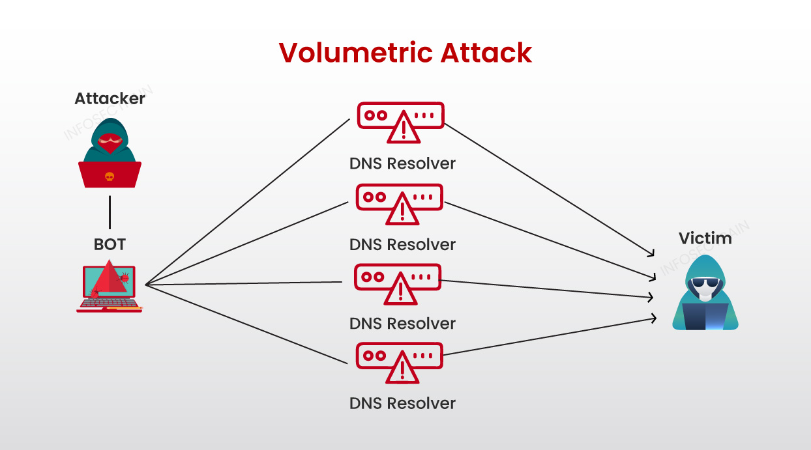
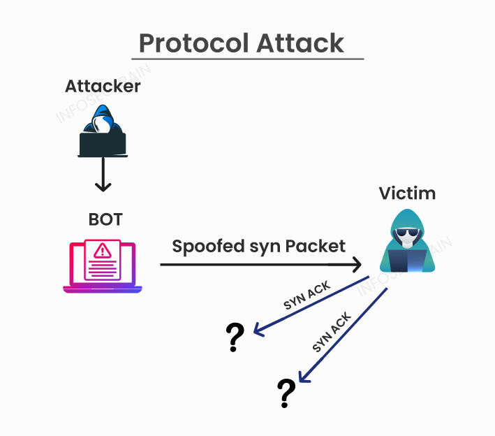
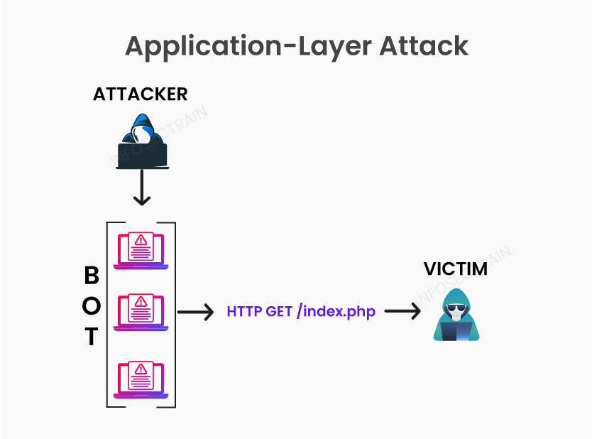

# DDoS attack 

## Introduction 

**DDoS Attack** means ```Distributed Denial-of-Service (DDoS) Attack``` , it is a malicious **cyberattack** in which the attacker attempt to disrupt the normal traffic of a targeted server, service, or network by *overwhelming the flood of Internet traffic* to prevent users from accessing connected online services and sites

It involves the orchestration of multiple compromised devices, known as a [botnet](https://en.wikipedia.org/wiki/Botnet), to launch a coordinated assault on a target system. These devices can include computers, servers, IoT devices, and even smartphones that have been infected with malware, allowing attackers to control them remotely. By harnessing the collective power of the botnet, attackers can generate an overwhelming flood of traffic, exhausting the target’s resources and causing a **denial of service**.

## Types of DDoS Attacks

There are three common types of DDoS attacks:

### Volumetric Attacks

These attacks overwhelm the network bandwidth with a flood of malicious traffic by sending enormous amounts of traffic to a targeted server, causing network congestion, packet loss, and service disruptions The goal is to consume all available bandwidth, rendering the service unavailable .The attacks are measured in bits per second (bps) or Gigabits per second (Gbps).



Figure 1: Volumetric Attacks


**Examples :** 

- ICMP floods
- DNS reflection floods
- UDP floods
- TCP out-of-state floods (**SYN**, **SYN-ACK**, **ACK**, etc.)
- Reflection amplification attacks

### Protocol Attacks

These attacks exploit weaknesses in network protocols to consume server resources or disrupt the connection between machines.



**Examples:**
- SYN Flood
- Ping of Death


### Application Layer Attacks

These attacks target the application layer (Layer 7 of the OSI model) where common internet requests such as HTTP GET and HTTP POST occur to disrupt specific services or applications.



**Types of application-layer attacks :**
- Denial-of-service attacks
- Slowloris attacks
- BGP hijacking
- Flood attacks
- Zero-day attacks


## Datasets for DDoS Research

### CAIDA Anonymized Internet Traces

**Description** : 

This dataset contains approximately one hour of anonymized traffic traces from a DDoS attack on August 4, 2007 (20:50:08 UTC to 21:56:16 UTC). This type of denial-of-service attack attempts to block access to the targeted server by consuming computing resources on the server and by consuming all of the bandwidth of the network connecting the server to the Internet.

The one-hour trace is split up in 5-minute pcap files. The total size of the dataset is **5.3 GB** (compressed; 21 GB uncompressed). Only attack traffic to the victim and responses to the attack from the victim are included in the traces. Non-attack traffic has as much as possible been removed. Traces in this dataset are anonymized using **CryptoPAn** prefix-preserving anonymization using a single key. The payload has been removed from all packets.

**Usage** :
Useful for studying network-wide impact and traffic patterns during DDoS attacks.

**Credit** : 
"CAIDA Anonymized Internet Traces," CAIDA (Center for Applied Internet Data Analysis).


### MAWI Working Group Traffic Archive

**Description**:

This dataset contains traffic traces collected from the WIDE backbone network, including various types of DDoS attacks. It is useful for analyzing long-term trends and specific attack incidents.

**Usage**:
Analyzing long-term trends and specific attack incidents.

**Credit**:
"MAWI Working Group Traffic Archive," WIDE Project.

---

### CICIDS2017 Dataset

**Description**:

This dataset contains both benign and malicious traffic, including several types of DDoS attacks, collected in a controlled environment. It is ideal for machine learning and anomaly detection research.

**Usage**:
Ideal for machine learning and anomaly detection research.

**Credit**:
"CICIDS2017 Dataset," Canadian Institute for Cybersecurity (CIC).

---

### NSL-KDD Dataset

**Description**:

An enhanced version of the KDD Cup 99 dataset, this dataset includes various types of network attacks. It is commonly used for evaluating intrusion detection systems.

**Usage**:
Commonly used for evaluating intrusion detection systems.

**Credit**:
"NSL-KDD Dataset," University of New Brunswick.

---

### UNSW-NB15 Dataset

**Description**:

This dataset was created using the IXIA PerfectStorm tool to generate synthetic network traffic, including DDoS attacks. It is used for training and testing intrusion detection systems and for benchmarking.

**Usage**:
Training and testing of intrusion detection systems and for benchmarking.

**Credit**:
"UNSW-NB15 Dataset," University of New South Wales.