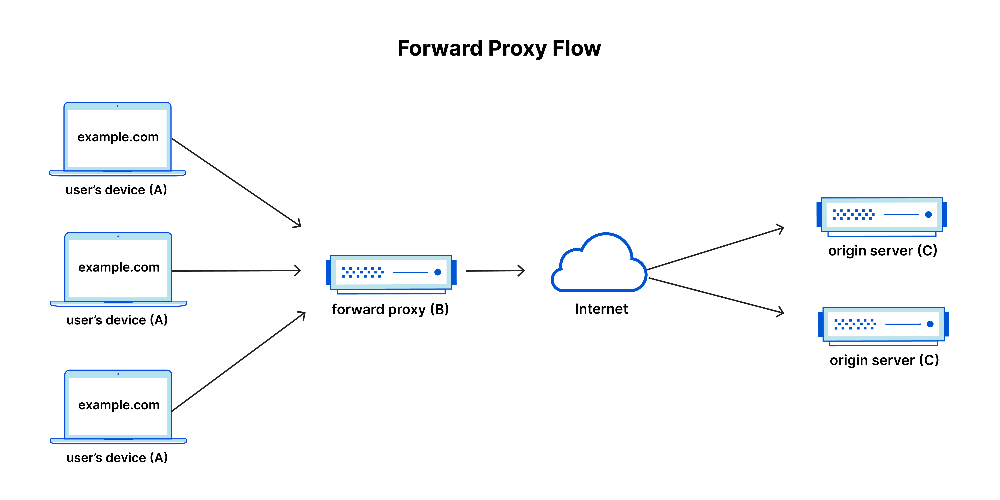

# Reverse Proxy

## Introduction

A **reverse proxy** is a server that sits between client devices and backend servers(web servers, database servers … etc ), forwarding client requests to the appropriate server and returning the server's response to the client. The reverse proxy serves as a gateway, making it seem as though the resources are coming from the proxy server itself which can  offer several advantages, including load balancing, improved security, SSL termination, and caching.

- Client sends a request, which the reverse proxy intercepts
- Reverse proxy forwards the incoming request to the firewall (the reverse proxy can be configured to respond directly to requests for files in its cache without communicating with the server—see more detail on this in the use cases)
- Firewall either blocks the request or forwards it to the server
- Server sends response through the firewall to the proxy
- Reverse proxy sends the response to the client

## Functionalities of a Reverse Proxy

- **Load Balancing** : Reverse proxies can be used to handle client requests that could otherwise overwhelm a single server with high demand
- **Caching** : They can cache content from an origin server in temporary storage, and then send the content to clients that request it without further transacting with the server. This reduces latency and improves performance.
- **SSL Termination** : They can handle the SSL encryption/decryption process
- **Network Protection** & **Security**: Reverse proxies can protect applications from exposure by scrubbing requests from clients.

